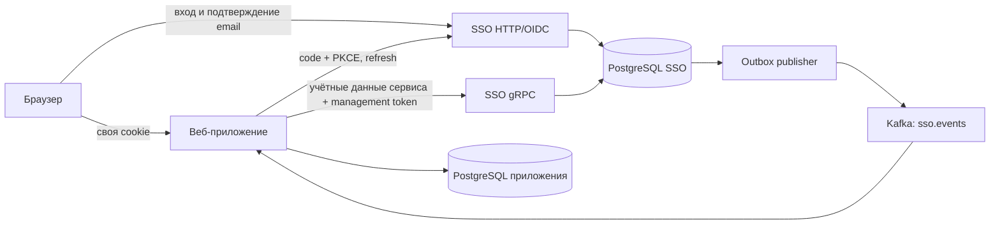

# SSO: устройство сервиса и подключение нового веб-приложения

Этот документ описывает **текущую реализацию в репозитории**, а не абстрактную схему OAuth. SSO выдаёт общую учётную запись, но право войти в конкретный проект выдаётся отдельно. Первый клиент — `main_api`; по тому же образцу можно подключить следующее серверное веб-приложение.

## 1. Кто за что отвечает

- **SSO** владеет email, паролем, подтверждением email, именем, адресом аватара, списком проектов, заявками на доступ, ролями в проектах, ключами подписи и журналом изменений. Его PostgreSQL — источник истины.
- **Проект** определяется `project_id`. Запись о доступе содержит пару `(user_id, project_id)` и массив ролей. Регистрация учётной записи сама по себе не даёт доступа ни к одному проекту.
- **OIDC-клиент** определяется `client_id`, привязан к одному проекту, имеет секрет и точный список разрешённых `redirect_uri`. Несколько клиентов одного проекта используют общие проектные роли.
- **Веб-приложение** хранит свою локальную сессию и, если нужно, копию общих полей в собственной БД. Оно не получает пароль пользователя. Браузеру выдаётся только непрозрачная cookie приложения; OAuth-токены остаются на сервере приложения.
- **Kafka** переносит изменения профиля и доступа в приложения. Доставка как минимум один раз, поэтому потребитель должен применять события идемпотентно.



В локальном Compose браузер открывает SSO по `http://localhost:8080`, пилотное приложение по `http://localhost:8081`, Mailpit по `http://localhost:8025`. Для внешнего развёртывания публичный `SSO_ISSUER` и адрес приложения должны быть HTTPS. Адрес SSO, видимый браузеру, и внутренний адрес для серверных запросов могут различаться; **значение `iss` в токене всегда равно публичному issuer**.

## 2. Структура исходников SSO

```text
sso/
├── cmd/sso/                 точка входа, команды оператора, запуск и остановка
├── internal/config/         загрузка и проверка настроек процесса
├── internal/provider/       HTTP/OIDC, регистрация и вход, gRPC management,
│                           создание записей аудита и outbox, метрики
│   ├── server.go            сборка сервиса и HTTP-маршруты
│   ├── clients.go           bootstrap, регистрация клиента, администратор проекта
│   ├── browser.go           страницы, email, browser session, заявки
│   ├── oauth.go             authorize, code exchange, refresh, userinfo
│   ├── grpc.go              gRPC transport
│   ├── management.go        проверки полномочий и команды управления
│   └── metrics.go           метрики outbox
├── internal/store/postgres/ подключение БД, миграции, чтение аккаунтов/клиентов
├── internal/token/          RS256-подпись, проверка JWT, JWKS и ротация ключей
├── internal/events/         публикация PostgreSQL outbox в Kafka
├── internal/security/       хеширование и проверка паролей
└── migrations/postgres/     версионированная схема
```

Пустые каталоги старого MySQL/JSON-прототипа удалены. Разделение вынесло хранилище, токены и Kafka из пакета провайдера; дальнейшее выделение полноценного прикладного слоя и типизированного gRPC-контракта описано в разделе «Ограничения».

### Основные таблицы SSO

- `accounts`, `email_verifications`, `browser_sessions` — аккаунты, одноразовые ссылки и сессии сайта SSO.
- `projects`, `oidc_clients`, `project_access`, `access_requests` — приложения, клиенты, роли и заявки.
- `authorization_codes`, `refresh_tokens`, `signing_keys` — OAuth-коды, семейства refresh-токенов и ключи JWT.
- `audit_events`, `outbox` — журнал действий и события для доставки.
- `schema_migrations` — применённая версия схемы.

SSO и каждое приложение используют **разные базы PostgreSQL**. Приложение не читает таблицы SSO напрямую.

## 3. Регистрация, вход и предоставление доступа

1. Пользователь открывает `/register`, задаёт email, имя и пароль. SSO сохраняет аккаунт без отметки подтверждения и отправляет ссылку через SMTP. Ссылка одноразовая, действует один час; в БД хранится хеш токена ссылки.
2. После `/verify?token=...` пользователь может войти на странице `/login`. SSO создаёт свою browser session на семь дней и ставит cookie `__Host-sso` с `Secure`, `HttpOnly`, `SameSite=Lax`, `Path=/`, без `Domain`. Эта cookie принадлежит только хосту SSO.
3. На `/projects` пользователь отправляет заявку через `POST /access/request`. Пока заявка не одобрена, `/authorize` возвращает приложению `error=access_pending` и исходный `state`. Пилот показывает `/pending`.
4. Администратор **этого проекта** через gRPC `ListRequests` и `ApproveRequest` назначает роли. Затем пользователь может завершить OIDC-вход. SSO не выдаёт роли другого проекта в его токене.
5. При повторном переходе из другого приложения на `/authorize` браузер уже имеет cookie SSO. Если доступ к проекту дан, пароль повторно вводить не нужно; каждое приложение всё равно создаёт собственную локальную сессию.

Страница администратора `/admin` в `main_api` — только пример UI. Решение об одобрении и проверка текущей роли `admin` происходят в SSO, а не в приложении.

## 4. OIDC-поток для серверного веб-приложения

Используется Authorization Code с обязательным PKCE `S256`. Discovery находится по `GET /.well-known/openid-configuration`, открытые ключи — по `GET /.well-known/jwks.json`. Перед разработкой клиента прочитайте discovery; не зашивайте адреса `/authorize` и `/token` в публичный SDK, если можно получить их из metadata.

### Шаг A. Начало входа

На сервере приложения создайте случайные `state`, `nonce` и `code_verifier` криптографическим генератором. Сохраните их в краткоживущем одноразовом состоянии входа, привязанном к браузеру. Вычислите:

```text
code_challenge = BASE64URL_NO_PADDING(SHA256(code_verifier))
```

Перенаправьте браузер на authorization endpoint:

```text
GET {SSO_ISSUER}/authorize?
    client_id=reports_web&
    redirect_uri=https%3A%2F%2Freports.example.com%2Fcallback&
    response_type=code&
    scope=openid%20profile%20email%20offline_access&
    state=<случайное значение>&
    nonce=<случайное значение>&
    code_challenge=<S256 challenge>&
    code_challenge_method=S256
```

SSO через Fosite проверяет зарегистрированного клиента и часть параметров authorization request, затем проверяет обязательные OIDC/PKCE-поля и **точное совпадение** `redirect_uri` с зарегистрированным значением. Код действует две минуты и одноразовый.

### Шаг B. Callback

Приложение принимает `GET /callback`. Сначала проверьте, что `state` точно совпадает с сохранённым значением, и атомарно удалите состояние входа. При `error=access_pending` покажите страницу ожидания. При `code` сервер приложения, а не браузерный JavaScript, отправляет `application/x-www-form-urlencoded` на token endpoint:

```text
POST {SSO_BACKCHANNEL_URL}/token
Authorization: Basic base64(client_id:client_secret)

 grant_type=authorization_code
 &code=<код из callback>
 &redirect_uri=https://reports.example.com/callback
 &code_verifier=<исходный verifier>
```

Текущая реализация принимает и `client_id`/`client_secret` в теле формы. Храните секрет только на сервере, в secret manager или переменной окружения. Не логируйте код, секрет и токены. Адрес `redirect_uri` должен совпасть с адресом, использованным на шаге A. Неверный verifier даёт `invalid_grant`.

### Шаг C. Проверка токенов и локальная сессия

Ответ `/token` содержит `access_token`, `id_token`, `refresh_token`, `management_token`, `token_type=Bearer`, `expires_in=300` и `scope`. `management_token` — **локальное расширение этого сервиса**, а не стандартное поле OIDC.

До создания сессии проверьте ID-токен по JWKS: разрешённый алгоритм `RS256`, подпись по `kid`, точные `iss=SSO_ISSUER`, `aud=client_id`, сохранённый `nonce`, `exp` и `nbf`/`iat` с разумным допуском часов. `sub` — стабильный идентификатор аккаунта; используйте его как ключ локального пользователя. Если используете `access_token` для авторизации запросов, также проверяйте его подпись, `typ=at+jwt`, `iss`, `aud=project_id`, сроки и состав ролей. Нельзя брать роли из непроверенного JWT.

Сохраните токены в серверной БД, создайте случайный идентификатор локальной сессии и храните его хеш. Браузеру поставьте host-only cookie приложения с `Secure`, `HttpOnly`, `SameSite=Lax`, `Path=/`, без `Domain`. **Не передавайте access/refresh/management токены в HTML или JavaScript.** Рекомендуемый срок локальной сессии ограничьте собственной политикой приложения.

Пилот `main_api` хранит `login_flows`, `app_sessions`, `local_users` в своей PostgreSQL. Для обычного запроса он читает свою сессию локально и обращается к SSO только когда нужен refresh или операция управления. Код пилота — отправная точка, но собственный клиент должен проверить все claims, необходимые его модели угроз.

### Шаг D. Обновление и отзыв

Access JWT и management JWT действуют пять минут. Refresh-токен действует семь дней, хранится в SSO как SHA-256 хеш и при каждом использовании заменяется. При повторном использовании старого токена SSO отзывает всё его семейство. В приложении блокируйте строку локальной сессии на время refresh: два параллельных запроса с одним refresh могут привести к отзыву семейства.

```text
POST /token
 grant_type=refresh_token
 &refresh_token=<текущий refresh>
```

Запрос также аутентифицируется `client_id` и секретом. На успешный ответ **атомарно** замените все сохранённые токены. При отказе удалите локальную сессию и попросите пользователя начать новый вход. SSO заново читает доступ и роли проекта при выдаче токенов. После отзыва доступа refresh перестаёт работать; Kafka-событие должно закрыть уже открытые локальные сессии быстрее.

### Какие аудитории у токенов

- ID-токен: `aud=client_id`, используется приложением для завершения входа; содержит email, имя, avatar URL и `nonce` исходного запроса.
- Access JWT: `aud=project_id`, `typ=at+jwt`, роли **одного проекта**; подходит API этого проекта и `/userinfo`.
- Management JWT: `aud={SSO_ISSUER}/grpc`, `typ=at+jwt`, `client_id`, `project_id` и `sub`; нужен только для защищённого gRPC SSO.
- Refresh-токен: непрозрачная строка для серверного `/token`, не JWT.

Нельзя подставлять management JWT вместо access JWT: аудитории разные. `GET /userinfo` требует `Authorization: Bearer <access_token>` и на стороне SSO повторно проверяет текущий проектный доступ.

## 5. Подключение нового проекта: пример `reports`

### 5.1. Подготовьте адреса и секрет

Пусть новое приложение доступно по `https://reports.example.com`, а callback равен `https://reports.example.com/callback`. Адрес должен быть финальным и точно совпасть во всех конфигурациях, включая схему, порт, путь и завершающий `/`. Wildcard и HTTP для удалённых хостов запрещены. Локальные `http://localhost` и `http://127.0.0.1` разрешены для разработки.

Создайте длинный случайный `client_secret` (минимум 24 символа) и сохраните его в менеджере секретов. `client_id=reports_web` и `project_id=reports` — разные идентификаторы; первый идентифицирует OAuth-клиент, второй область ролей.

### 5.2. Зарегистрируйте клиент

Из корня workspace с запущенным Compose:

```sh
SSO_NEW_CLIENT_SECRET='<секрет длиной не менее 24 символов>' \
  docker compose exec -T -e SSO_NEW_CLIENT_SECRET sso /sso \
  --register-client reports_web reports https://reports.example.com/callback
```

Можно перечислить несколько **точных** redirect URI следующими аргументами, например отдельный локальный callback. Команда создаёт проект, если его ещё нет, и регистрирует клиента. Повторная регистрация того же `client_id` завершится ошибкой; для изменения списка URI пока нужна отдельная операторская процедура/миграция — открытого API изменения клиента нет.

### 5.3. Назначьте первого администратора проекта

Пусть будущий администратор создаст аккаунт на SSO и подтвердит email. Оператор, имеющий доступ к консоли сервиса, выполняет:

```sh
docker compose exec -T sso /sso \
  --grant-project-admin reports admin@reports.example.com
```

Команда требует **существующий подтверждённый аккаунт**, добавляет ему роль `admin` проекта `reports`, пишет аудит и outbox-событие. Без такого шага никто не сможет одобрять первые заявки нового проекта. Выполняйте команду через доверенный операторский доступ к контейнеру; она не доступна через публичный HTTP.

### 5.4. Настройте новое приложение

Потребуются как минимум:

```text
SSO_ISSUER=https://sso.example.com              # публичный URL и ожидаемый iss
SSO_BACKCHANNEL_URL=https://sso.example.com     # адрес серверных запросов /token и JWKS
OIDC_CLIENT_ID=reports_web
OIDC_CLIENT_SECRET=<секрет из регистрации>
OIDC_PROJECT=reports
APP_BASE_URL=https://reports.example.com
SSO_GRPC_ADDR=sso.internal.example.com:9090
SSO_GRPC_TLS_CA=/run/secrets/sso-ca.pem
KAFKA_BROKER=<адрес долговечного кластера>
```

Это образец имён переменных для нового приложения; готовый `main_api` использует `MAIN_BASE_URL` и `MAIN_DATABASE_URL`. Поднимите **собственную** PostgreSQL БД приложения. Настройте TLS для публичного SSO и gRPC; Compose использует внутренний незашифрованный gRPC только как локальное окружение.

Реализуйте `/login`, `/callback`, локальную сессию, refresh, `/pending`, авторизацию по ролям и обработчик выхода по схеме раздела 4. Если приложению нужны профиль или администрирование, добавьте gRPC-клиент и потребителя Kafka, как описано ниже. Если управление не нужно, ему достаточно OIDC и локальной сессии, но отзыв доступа всё равно должен закрывать сессии через события либо через политику refresh.

## 6. gRPC API управления

Сейчас transport зарегистрирован как `sso.Management`, методы вызываются по полному имени `/sso.Management/<Method>`. Запрос и ответ — `google.protobuf.Struct`; поля передаются как JSON-подобные значения. **Это текущий внутренний контракт, без опубликованного `.proto` и сгенерированного SDK.** Клиенту нужны три metadata-поля:

```text
x-client-id: reports_web
x-client-secret: <client_secret>
authorization: Bearer <management_token пользователя>
```

Каждый запрос содержит `project_id=reports`. SSO проверяет секрет клиента, что клиент принадлежит проекту, подпись/аудиторию/срок management JWT, текущий доступ пользователя и, для административных методов, текущую роль `admin`. Таким образом изменение ролей не ждёт истечения старого токена для gRPC-проверки.

Методы и значимые поля:

- `GetUser`: `project_id`, необязательный `user_id` (по умолчанию текущий). Просмотр чужого профиля требует `admin`. Ответ: `user_id`, `email`, `name`, `avatar_url`, `roles`.
- `UpdateProfile`: `project_id`, `user_id`, `name`, `avatar_url`. Пользователь может изменить только свой профиль. Ответ содержит новые общие поля. Изменение и событие `profile.updated` фиксируются в одной транзакции SSO.
- `ListRequests`: `project_id`. Требует `admin`; возвращает `requests` с `request_id`, `user_id`, `email`, `name`.
- `ApproveRequest`: `project_id`, `request_id`, `roles` (массив строк, по умолчанию `member`). Требует `admin`; создаёт доступ и событие `access.granted`.
- `SetRoles`: `project_id`, `user_id`, `roles` (непустой массив). Требует `admin`; выдаёт `roles.changed`.
- `RevokeAccess`: `project_id`, `user_id`. Требует `admin`; удаляет проектный доступ, отзывает refresh-токены проекта и выдаёт `access.revoked`.

Приложение должно отдельно проверять CSRF и права на собственных HTTP-формах. gRPC-проверка SSO — последняя граница для общих данных, она не заменяет контроль доступа в бизнес-эндпоинтах приложения.

## 7. Синхронизация профиля и ролей

### Запись профиля

Порядок при изменении через приложение:

1. Приложение вызывает `UpdateProfile` по gRPC.
2. SSO в одной PostgreSQL-транзакции меняет `accounts`, пишет `audit_events` и `outbox`.
3. После успешного ответа приложение обновляет локальную копию. Если этот шаг не удался, ответ пилота — HTTP `202 {"status":"sync_pending"}`: в SSO запись уже сделана, локальную копию догонят событие и сверка.

Не меняйте сначала локальную копию: так при отказе SSO приложение покажет данные, которых источник истины не знает.

### События Kafka

SSO публикует в топик `sso.events` сообщения вида:

```json
{
  "id": "<стабильный id события>",
  "project_id": "reports",
  "type": "profile.updated",
  "payload": {
    "user_id": "<sub>",
    "email": "user@example.com",
    "name": "Новое имя",
    "avatar_url": "https://example.com/avatar.png"
  }
}
```

Есть типы `profile.updated`, `access.granted`, `roles.changed`, `access.revoked`. Для доступа payload содержит `user_id` и `roles`; для отзыва — `user_id`. Потребитель фильтрует `project_id`, в **одной локальной транзакции** сохраняет `id` в таблице обработанных событий и применяет изменение, а Kafka offset подтверждает только после commit. При `access.revoked` удалите локальные сессии пользователя. `main_api` использует именно такую схему и периодически сравнивает активные локальные копии с SSO.

Строка outbox остаётся в PostgreSQL до подтверждения Kafka. При сбое возможна повторная публикация, поэтому обработчик обязан быть идемпотентным. Пилотная конфигурация Kafka имеет один раздел и один broker; для производственного кластера требуются долговечное хранение, репликация, мониторинг лагов и политика восстановления.

### Если SSO или Kafka недоступны

При недоступной Kafka приложение продолжает обслуживать локальные сессии, пока действуют текущие пятиминутные токены. После этого refresh должен успешно обратиться к SSO; при отказе приложение удаляет сессию. Это ограничивает окно устаревших ролей, но мгновенного отзыва при сетевом разделении нет. При недоступном SSO новый вход, refresh и gRPC-изменения недоступны. Приложение должно показывать пользователю временную ошибку, а не считать неудачную синхронизацию успешной.

## 8. Эксплуатация и проверка

Локальный запуск из корня workspace:

```sh
docker compose up --wait -d --build
```

В SSO обязательна `SSO_DATABASE_URL`; `SSO_ISSUER` задаёт публичный issuer (в локальной среде по умолчанию `http://localhost:8080`). Остальные основные параметры: `SSO_HTTP_PORT`, `SSO_GRPC_PORT`, `SSO_GRPC_TLS_CERT`, `SSO_GRPC_TLS_KEY`, `SSO_SMTP_ADDR`, `SSO_SMTP_FROM`, `SSO_SMTP_MODE` (`starttls`, `tls`, локальный `plain`), `SSO_SMTP_USER`, `SSO_SMTP_PASSWORD`, `KAFKA_BROKER`. Bootstrap-переменные в `compose.yaml` создают `main_api` и первоначального администратора локальной среды. В production секреты должны поступать из защищённого хранилища, а PostgreSQL и Kafka — иметь резервные копии и мониторинг.

Команда ротации ключа:

```sh
docker compose exec -T sso /sso --rotate-key
```

Новый ключ сразу становится активным. Предыдущие открытые ключи остаются в JWKS десять минут, чтобы уже выданные пятиминутные JWT можно было проверить. Приватные ключи сейчас лежат в PostgreSQL; доступ к БД и резервным копиям должен быть ограничен.

Проверка после изменений:

```sh
(cd sso && go test ./...)
(cd main_api && go test ./...)
python3 scripts/smoke.py
python3 scripts/recovery.py
python3 scripts/key_rotation.py
```

`/healthz` сообщает, что HTTP-процесс отвечает; он пока не проверяет готовность зависимостей. SSO `/metrics` показывает `sso_outbox_pending`, `sso_outbox_retried`, `sso_outbox_oldest_age_seconds`. У `main_api` `/metrics` есть число ошибок Kafka, обработанных событий, `sync_pending` и расхождений активных копий. Настройте алерты по возрасту outbox, лагу потребителя, ошибкам refresh и расхождениям; периодически проверяйте восстановление после остановки Kafka и приложения.

## 9. Что ещё нужно до высокой производственной нагрузки

Разделение пакетов и корректный жизненный цикл процесса — шаг к обслуживаемой архитектуре, но **сам по себе этот сервис ещё нельзя считать готовым для крупного production**. Приоритетные следующие работы:

1. Ввести версионированный `.proto` для management API и сгенерированные клиенты вместо динамического `Struct`; зафиксировать правила совместимости и контрактные тесты.
2. Перевести весь OAuth/OIDC grant/token pipeline на проверенный provider framework или провести отдельный протокольный аудит собственного code exchange, refresh и JWT. Сейчас Fosite участвует в проверке authorization request, остальные шаги реализованы в сервисе.
3. Вынести SQL из HTTP/gRPC-обработчиков в репозитории и прикладные операции; добавить интеграционные тесты на границе БД, особенно для конкурентного refresh, аудита и outbox.
4. Добавить защиту от перебора паролей, лимиты регистрации/повторной отправки email, надёжную доставку писем, управление сессиями и безопасные процедуры смены/отзыва client secret.
5. Использовать managed secrets/KMS для ключей подписи, TLS для всех каналов, readiness-проверки, структурированные логи и трассировку. Планировать резервное копирование и восстановление PostgreSQL, репликацию Kafka и постепенные миграции схемы.
6. Перед масштабированием до нескольких экземпляров проверить порядок событий по пользователю, нагрузку на outbox, политику хранения аудита и удаление просроченных кодов, сессий и токенов.

Эти пункты — известные ограничения текущей реализации, а не дополнительные действия, которые нужны каждому новому веб-приложению прямо сейчас.
